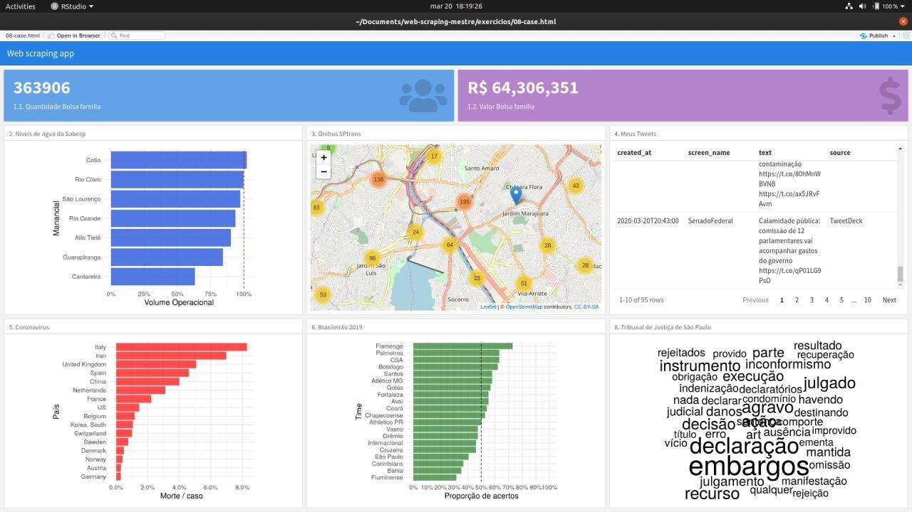

```{r, child="00-preamble.Rmd"}

```

class: middle, center

# Sobre a Curso-R

---

class: middle, center

## A empresa

.pull-left[
```{r, echo = FALSE}
knitr::include_graphics("https://d33wubrfki0l68.cloudfront.net/295643c6243701ae6a9bac3fb8ad467ff0ce3c84/d1785/img/logo/cursor1-41.png")
```

<br>
<br>

```{r, echo = FALSE}
knitr::include_graphics("img/logo_r6.png")
```

]

.pull-right[
```{r, echo = FALSE}
knitr::include_graphics("img/produtos.png")
```
]

### [www.curso-r.com](https://www.curso-r.com)

---

## Ministrantes

.pull-left[

### Julio Trecenti

```{r, echo=FALSE, out.width="30%"}

```


Doutorando em Estatística pelo IME-USP. Secretário-geral da Associação Brasileira de Jurimetria (ABJ). Conselheiro do CONFE. Sócio da Terranova Consultoria. Trabalha com web scraping, arrumação de dados, construção de modelos preditivos, APIs, pacotes em R e dashboards em Shiny.

]


.pull-right[

### Caio Lente

```{r, echo=FALSE, out.width="30%"}

```


Mestrando em Ciência da Computação no IME-USP e cientista de dados na Terranova Consultoria. Começou a se apaixonar pelo R em 2016 e agora não fala em outra coisa. Metido a designer, maníaco da organização e metade texano.

]

---

## Linha do tempo

<center>
</img>
</center>

---

## Nossos cursos

.pull-left[
<div class="container center">
  <div class="card">
    <h2>Programação em R</h2>
    <hr style = "background-color: #3bb44a;"/>
    <p><a href = "https://www.curso-r.com/cursos/r4ds-1/">R para Ciência de dados I</a></p>
        <p><a href = "https://www.curso-r.com/cursos/r4ds-2/">R para Ciência de dados II</a></p>
        <p><a href = "https://www.curso-r.com/cursos/rcpp/">Introdução ao R com C++</a></p>
  </div>
</div>

<br>

<div class="container center">
  <div class="card">
    <h2>Modelagem</h2>
    <hr style = "background-color: #996699;"/>
    <p><a href = "https://www.curso-r.com/cursos/regressao-linear/">Regressão Linear</a></p>
    <p><a href = "https://www.curso-r.com/cursos/intro-machine-learning/">Machine Learning</a></p>
    <p><a href = "https://www.curso-r.com/cursos/xgboost/">XGBoost</a></p>
    <p><a href = "https://www.curso-r.com/cursos/deep-learning/">Deep Learning</a></p>
  </div>
</div>
]


.pull-right[
<div class="container center">
  <div class="card">
    <h2>Extração de dados</h2>
    <hr style = "background-color: #eeba30;"/>
    <p><a href = "https://www.curso-r.com/cursos/web-scraping/">Web scraping</a></p>
  </div>
</div>

<br>

<div class="container center">
  <div class="card">
    <h2>Comunicação e automação</h2>
    <hr style = "background-color: #ff6699;"/>
    <p><a href = "https://www.curso-r.com/cursos/dashboards/">Dashboards com R</a></p>
        <p><a href = "https://www.curso-r.com/cursos/deploy/">Deploy</a></p>
  </div>
</div>
]

---
class: middle, center

# Sobre o curso

---

# Web scraping

## Introdução

- O que é e quando fazer web scraping

- O ciclo do web scraping

- Noções de protocolo HTTP

- Acessando dados de APIs

---

# Web scraping

## Web scraping de fato

- Como fazer requisições HTTP e baixar páginas web a partir do R

- Como estruturar dados de arquivos .xml, .html e .json

- Como iterar algoritmos no R

---

# Web scraping

## Tópicos

- Tratamento de erros

- Paralelização

- Páginas dinâmicas com Selenium

---

# Resultados

No final, você terá dados suficientes para montar um dashboard como esse!

```{r, echo=FALSE}

```

---

# Dinâmica

- Pelo menos um exemplo prático por aula
    - Foco: APIs públicas, sites públicos

- Exercícios para casa, com entrega facultativa

- Trabalho final, com entrega obrigatória
    - As pessoas que fizerem os melhores trabalhos receberão uma bolsa para fazer qualquer curso da Curso-R
    - Mais detalhes sobre o trabalho final nas próximas aulas

---

# Tirando dúvidas

- **Não existe dúvida idiota**.
 
- Nem sempre é trivial fazer a pergunta certa para que outra pessoa esclareça a sua dúvida. Neste curso, **vamos mostrar melhores práticas na hora de fazer perguntas sobre programação**.
 
- Fora do horário de aula ou monitoria:
  - perguntas gerais sobre o curso deverão ser feitas no Classroom.
  - perguntas sobre R, principalmente as que envolverem código, deverão ser enviadas no [nosso discourse](https://discourse.curso-r.com/). Se envolver web scraping, é importante especificar a página que está querendo acessar e como você faria para encontrá-la manualmente.

- [Veja aqui dicas de como fazer uma boa pergunta](https://discourse.curso-r.com/t/como-escrever-uma-boa-pergunta/542).

---
# Por que usar o discourse?

- Muito melhor para escrever textos que possuem códigos. Com ele, podemos usar o pacote `{reprex}`!

- Saber pesquisar sobre erros e fazer a pergunta certa é essencial para aprender e resolver problemas de programação.

- No discourse, teremos mais pessoas acompanhando e respondendo as dúvidas.

- Em um ambiente aberto, as suas dúvidas vão contribuir com a comunidade.

### https://discourse.curso-r.com/
