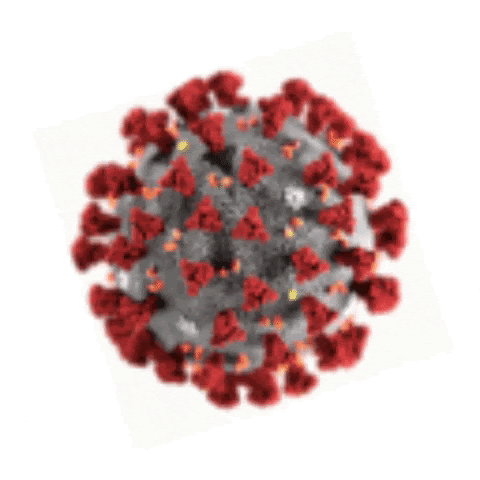

```{r, child="00-preamble.Rmd"}

```

# Exemplo 03: SPTrans

[Documentação da API OlhoVivo](http://www.sptrans.com.br/desenvolvedores/api-do-olho-vivo-guia-de-referencia/documentacao-api/)

```{r eval=FALSE}
u_sptrans <- "http://api.olhovivo.sptrans.com.br/v2.1"
endpoint <- "/Posicao"
u_sptrans_busca <- paste0(u_sptrans, endpoint)
(r <- httr::GET(u_sptrans_busca))
```

      Response [http://api.olhovivo.sptrans.com.br/v2.1/Posicao]
        Date: 2020-11-11 17:39
    *   Status: 401
        Content-Type: application/json; charset=utf-8
        Size: 61 B

```{r eval=FALSE}
httr::content(r)
```

      #> $Message
    * #> [1] "Authorization has been denied for this request."

---

# Vamos ao R!

```{r, echo=FALSE, fig.align="center"}
knitr::include_graphics("img/cat.gif")
```

---

# GET e POST

- **GET** utiliza parâmetros na URL
    - Utilizar parâmetro `query=`

- **POST** utiliza parâmetros no corpo da requisição
    - Utilizar o parâmetro `body=`
    - Pode utilizar parâmetros na URL, mas não é comum
    
- A principal diferença entre os dois tipos é a **segurança**

---

# Exemplo 04: Twitter 

- Utiliza OAuth2.0

- É possível autenticar sem fazer uma conta de desenvolvedor

- Usamos o pacote [`{rtweet}`](https://docs.ropensci.org/rtweet)

- Outros pacotes podem ter uma autenticação mais complicada

- Exemplos de pacotes que utilizam OAuth2.0
    - [`{googlesheets4}`](https://googlesheets4.tidyverse.org)
    - [`{rdrop2}`](https://github.com/karthik/rdrop2)

- O `{httr}` possui funcionalidades para conectar com serviços OAuth2.0

- Um exemplo de implementação é o pacote [`{auth0}`](https://curso-r.github.io/auth0)

---

# Vamos ao R!

```{r, echo=FALSE, fig.align="center"}
knitr::include_graphics("img/cat.gif")
```

---

# Exemplo 05: Covid-19

- Nem sempre é necessário aplicar web scraping...

- No caso do [site do Ministério da Saúde](https://covid.saude.gov.br), só é necessário se nosso interesse for atualizar a base periodicamente.

```{r echo=FALSE, fig.align="center", out.width="30%"}

```

---

# Vamos ao R!

```{r, echo=FALSE, fig.align="center"}
knitr::include_graphics("img/cat.gif")
```

