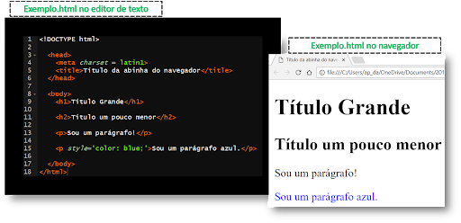
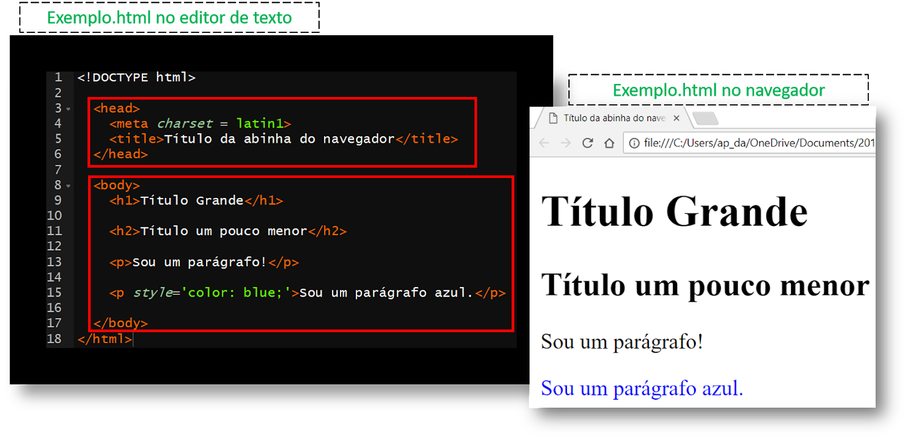
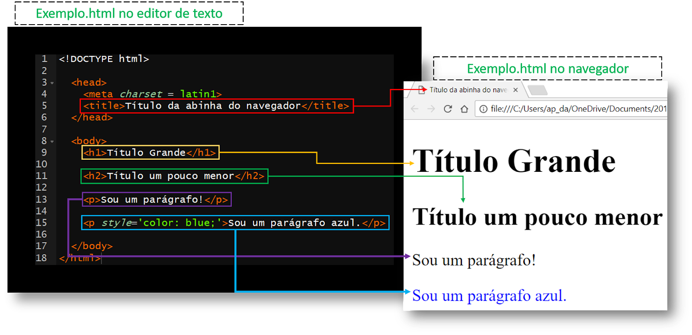
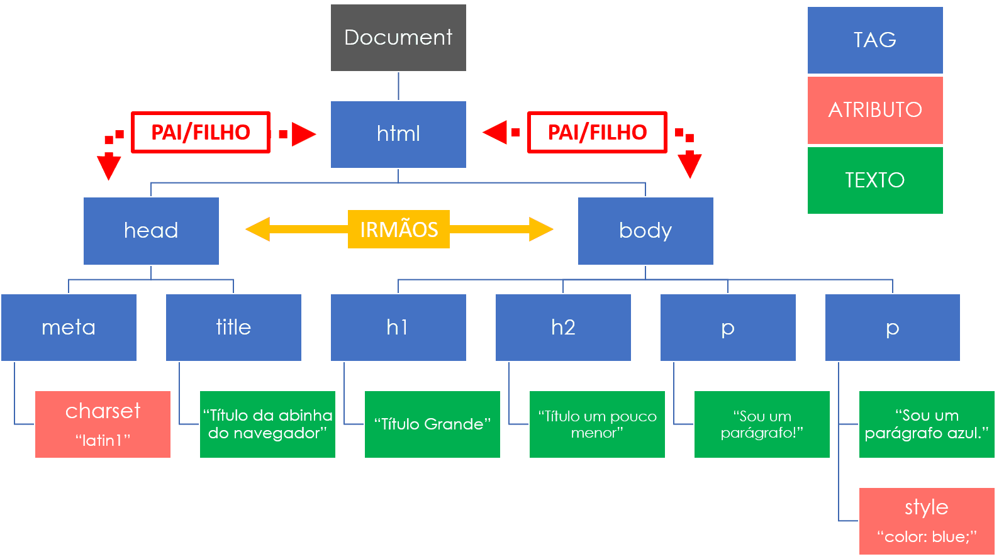

```{r, child="00-preamble.Rmd"}

```

# Fluxo do web scraping

.pull-left[

#### 1. Imitar

- Na aba Network seu navegador, investigue as requisições.
- Tente imitá-las no R, copiando os caminhos e parâmetros utilizados.

#### 2. Coletar

- Baixar todas as páginas HTML (ou outro formato).
- Boa prática: salvar arquivos brutos com `httr::write_disk()`.

]

.pull-right[

#### 3. Parsear

- Transformar os dados brutos em uma base de dados passível de análise.
- Utilizar pacotes `{xml2}`, `{jsonlite}`, `{pdftools}`, dependendo do arquivo.

#### Pacotes

- Utilizar `{httr}` para imitar/coletar.
- Utilizar `{xml2}` para parsear.
- Utilização massiva do `{tidyverse}`.

]

---

# HTML

- HTML (Hypertext Markup Language) é uma linguagem de marcação cujo uso é a criação de páginas web. 

- Por trás de todo site há pelo menos um arquivo .html.

```{r, echo=FALSE}

```

---

# HTML

- Todo arquivo HTML pode ser dividido em seções que definirão diferentes aspectos da página. 
- `<head>` descreve metadados, enquanto `<body>` é o corpo da página.

```{r, echo=FALSE}

```

---

# HTML

- Tags (head, body, h1, p, ...) demarcam as seções e sub-seções

- enquanto atributos (charset, style, ...) mudam como essas seções são renderizadas pelo navegador.

```{r, echo=FALSE}

```

---

# Teoria

1) Todo HTML se transforma em um DOM (document object model) dentro do navegador.

2) Um DOM pode ser representado como uma árvore em que cada node é:

- ou um atributo
- ou um texto
- ou uma tag
- ou um comentário

3) Utiliza-se a relação de pai/filho/irmão entre os nós.

4) Para descrever a estrutura de um DOM, usamos uma linguagem de markup chamada XML (Extensible Markup Language) que define regras para a codificação de um documento.

---

# HTML

O HTML do exemplo, na verdade, é isso aqui:

```{r, echo=FALSE}

```

---

# Vamos ao R!

```{r, echo=FALSE, fig.align="center"}
knitr::include_graphics("img/cat.gif")
```

