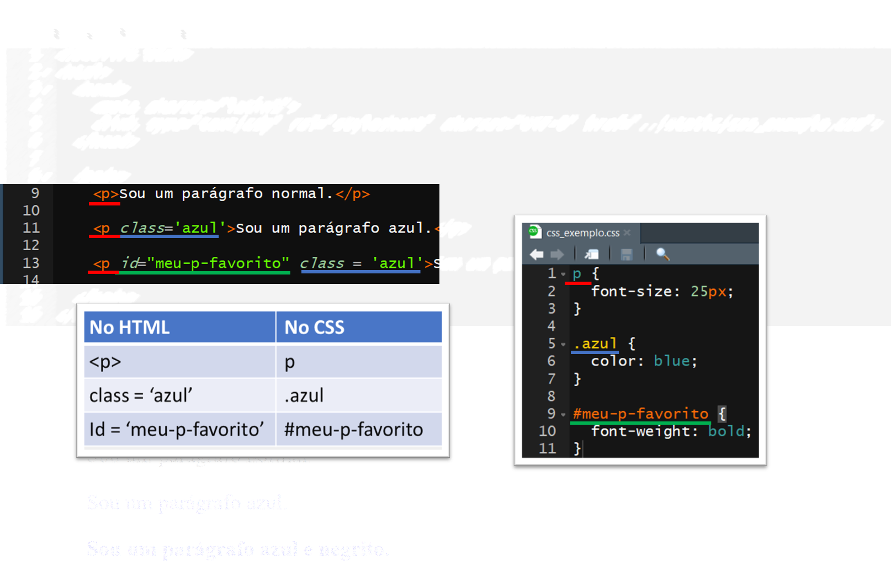

```{r, child="00-preamble.Rmd"}

```

# XPath - XML Path Language

- Exemplo: coletando todas as tags `<p>` (parágrafos)

```{r}
library(xml2)

# Ler o HTML
html <- read_html("img/html_exemplo.html")

# Coletar todos os nodes com a tag <p>
nodes <- xml_find_all(html, "//p")

# Extrair o texto contido em cada um dos nodes
text <- xml_text(nodes)
text
```

---
# XPath - XML Path Language

- Com `xml_attrs()` podemos extrair todos os atributos de um node:

```{r}
xml_attrs(nodes)
xml_attr(nodes, "style")
```

---
# XPath - XML Path Language

- Já com `xml_children()`, `xml_parents()` e `xml_siblings()` podemos acessar a
estrutura de parentesco dos nós:

```{r}
heads <- xml_find_all(html, "head")
xml_siblings(heads)

xml_children(heads)
```

---

# {rvest}

- Pacote construído sobre `{xml2}` e `{httr}`

- Busca facilitar a vida com alguns helpers

- Permite utilização de CSS path, uma alternativa ao XPath

- Na prática, no entanto, pode ser improdutivo utilizá-lo

- No nosso curso, só vamos utilizar a função `rvest::html_table()`, que transforma o conteúdo de  uma tag `<table>` em um `data.frame`.


---
# CSS

- CSS (Cascading Style Sheets) descrevem como os elementos HTML devem se
apresentar na tela. Ele é responsável pela aparência da página.

```{html}
<p style='color: blue;'>Sou um parágrafo azul.</p>
```

- O atributo `style` é uma das maneiras de mexer na aparência utilizando CSS. No
exemplo,

- `color` é uma **property** do CSS e 
- `blue` é um **value** do CSS.

- Para associar esses pares **properties/values** aos elementos de um DOM, existe uma ferramenta chamada **CSS selectors**. Assim como fazemos com XML, podemos usar esses seletores (através do pacote `rvest`) para extrair os nós de uma página HTML.

---
# CSS

- Abaixo vemos um `.html` e um `.css` que é usado para estilizar o primeiro. Se os nós indicados forem encontrados pelos seletores do CSS, então eles sofrerão as mudanças indicadas.

```{r, echo = FALSE, dpi = 240, fig.align='center'}

```

---
# Seletores CSS vs. XPath

- A grande vantagem do XPath é permitir que acessemos os filhos, pais e irmãos de um nó. De fato os seletores CSS são mais simples, mas eles também são mais limitados.

- O bom é que se tivermos os seletores CSS, podemos transformá-los sem muita dificuldade em um query XPath:

- Seletor de tag: `p` = `//p`
- Seletor de classe: `.azul` = `//*[@class='azul']`
- Seletor de id: `#meu-p-favorito` = `//*[@id='meu-p-favorito']`

- Além disso, a maior parte das ferramentas que utilizaremos ao longo do processo trabalham preferencialmente com XPath.

---
# Seletores CSS vs. XPath

```{r}
html <- read_html("img/html_exemplo_css_a_parte.html")
xml_find_all(html, "//p")

xml_find_all(html, "//*[@class='azul']")
```

---
# Seletores CSS vs. XPath

```{r}
rvest::html_nodes(html, ".azul")
```

- Note que `//p` indica que estamos fazendo uma busca na tag `p`, enquanto `//*` indica que estamos fazendo uma busca em qualquer tag.

---
# Exemplo

Acesse o site de buscas [DuckDuckGo.com](https://duckduckgo.com). Baixe a página de buscas. Dica: use a função `httr::GET()`.

--

```{r}
library(httr)
GET("https://duckduckgo.com")
```

---
# Exemplo

Examine o código-fonte da página para encontrar o elemento correspondente à
caixa de busca e copie o seu XPath pelo navegador. Esse XPath é apropriado? Por
que?

--

```
//*[@id="search_form_input_homepage"]
```

Alternativa com CSS Path

```
#search_form_input_homepage
```

Uma forma mais simples talvez fosse

```
//input[@name="q"]
```

---

# Vamos ao R!

```{r, echo=FALSE, fig.align="center"}
knitr::include_graphics("img/cat.gif")
```

